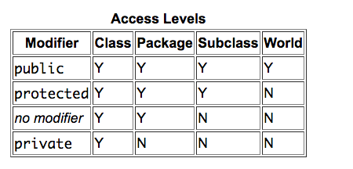
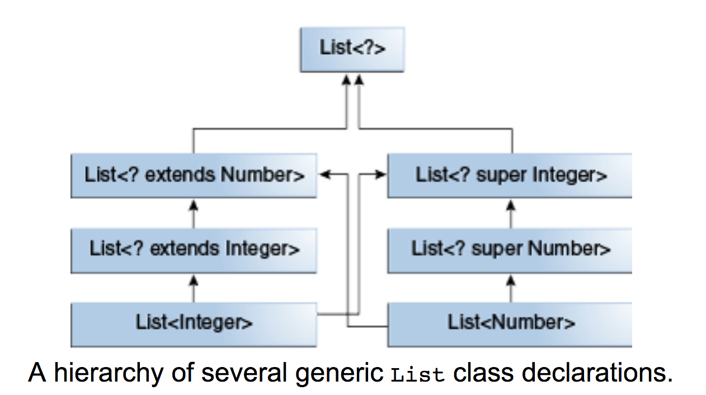

# Notes of Reading Java Tutorial
## Class related
In general, class declarations can include these components, in order:

1. Modifiers such as public, private, and a number of others that you will encounter later.
2. The class name, with the initial letter capitalized by convention.
3. The name of the class's parent (superclass), if any, preceded by the keyword extends. A class can only extend (subclass) one parent.
4. A comma-separated list of interfaces implemented by the class, if any, preceded by the keyword implements. A class can implement more than one interface.  The class body, surrounded by braces, {}.

```java
	public double calculateAnswer(double wingSpan, int numberOfEngines,
	                              double length, double grossTons) {
	    //do the calculation here
	}
```

**Method naming convention**: 

Although a method name can be any legal identifier, code conventions restrict method names. By convention, method names should be a verb in lowercase or a multi-word name that begins with a verb in lowercase, followed by adjectives, nouns, etc. In multi-word names, the first letter of each of the second and following words should be capitalized. Here are some examples:
*run
runFast
getBackground
getFinalData
compareTo
setX
isEmpty*

**Overloading Methods**: 

Overloaded methods are differentiated by the number and the type of the arguments passed into the method. In the code sample, `draw(String s)` and `draw(int i)` are distinct and unique methods because they require different argument types.  Note the compiler does not consider return type when differentiating methods, so you cannot declare two methods with the same signature even if they have a different return type.

**Arbitrary Number of Arguments**

You can use a construct called varargs to pass an arbitrary number of values to a method. 

```java
	public Polygon polygonFrom(Point... corners) {
	    int numberOfSides = corners.length;
	    double squareOfSide1, lengthOfSide1;
	    squareOfSide1 = (corners[1].x - corners[0].x)
		...
```

It works just like Arrays.

**Class Constructors** 

As with methods, the Java platform differentiates constructors on the basis of the number of arguments in the list and their types.  The compiler automatically provides a no-argument, default constructor for any class without constructors. This **default** constructor will call the no-argument constructor of the superclass. In this situation, the compiler will complain if the superclass doesn't have a no-argument constructor so you must verify that it does. If your class has no explicit superclass, then it has an implicit superclass of Object, which does have a no-argument constructor.

**Passing Primitive Data Type verses Reference Data Type Arguments.**

Primitive arguments, such as an int or a double, are passed into methods by value. This means that any changes to the values of the parameters exist only within the scope of the method. When the method returns, the parameters are gone and any changes to them are lost.

```java
	public static void passMethod(int p) {
	        p = 10;
	}             
        int x = 3;        
        passMethod(x);                 
        System.out.println("After invoking passMethod, x = " + x);	
```

The out put is `3`.

Reference data type parameters, such as objects, are also passed into methods by value. This means that when the method returns, the passed-in reference still references the same object as before. However, the values of the object's fields can be changed in the method, if they have the proper access level.

**Creating Objects**
The *new* operator instantiates a class by allocating memory for a new object and returning a reference to that memory. The *new* operator also invokes the object constructor.

You can also declare a reference variable on its own line. For example:

`Point originOne;`
If you declare originOne like this, its value will be undetermined until an object is actually created and assigned to it. Simply declaring a reference variable does not create an object. For that, you need to use the new operator, as described in the next section. You must assign an object to originOne before you use it in your code. Otherwise, you will get a compiler error.

**The garbage collector**:

Some object-oriented languages require that you keep track of all the objects you create and that you explicitly destroy them when they are no longer needed. Managing memory explicitly is tedious and error-prone. The Java platform allows you to create as many objects as you want (limited, of course, by what your system can handle), and you don't have to worry about destroying them. The Java runtime environment deletes objects when it determines that they are no longer being used. This process is called garbage collection.

An object is eligible for garbage collection when there are **no more references to that object**. References that are held in a variable are usually dropped when the variable goes out of scope. Or, you can explicitly drop an object reference by setting the variable to the special value null. **Remember that a program can have multiple references to the same object; all references to an object must be dropped before the object is eligible for garbage collection**.

The Java runtime environment has a garbage collector that periodically frees the memory used by objects that are no longer referenced. The garbage collector does its job automatically when it determines that the time is right.

**Returning a Class or Interface**

When a method uses a class name as its return type, the class of the type of the returned object must be either a **subclass** of, or the exact class of, the return type. It is also called *covariant
return type*.  If the return type is an **interface name**, the object returned must implement the specific interface.

**Using `this`**

1. The most common reason for using the this keyword is because a field is shadowed by a method or constructor parameter.

```java
public class Point {
    public int x = 0;
    public int y = 0;       
    //constructor
    public Point(int x, int y) {
        this.x = x;
        this.y = y;
    }
	}
```

2. Using `this` with a Constructor


```java 
 public class Rectangle {
    private int x, y;
    private int width, height;        
    public Rectangle() {
        this(0, 0, 1, 1);
    }
    public Rectangle(int width, int height) {
        this(0, 0, width, height);
    }
    public Rectangle(int x, int y, int width, int height) {
        this.x = x;
        this.y = y;
        this.width = width;
        this.height = height;
    }
    ...
}
```

**Access levels**

- At the top level—public, or package-private (no explicit modifier).
- At the member level—public, private, protected, or package-private (no explicit modifier).
If a class has no modifier (the default, also known as package-private), it is visible only within its own package (packages are named groups of related classes).   For members, there are two additional access modifiers: *private* and *protected*. The private modifier specifies that the member can only be accessed in its own class. The *protected* modifier specifies that the member can only be accessed within its own package (as with package-private) and, in addition, by a *subclass* of its class in another package.



Tips for choosing an access level:

- Use the most restrictive access level that makes sense for a particular member. **Use private    unless you have a good reason not to**.
- Avoid public fields except for constants.  Public fields tend to link you to a particular implementation and **limit your flexibility in changing your code**.

**Class variables and `static`**

When a number of objects are created from the same class blueprint, they each have their own distinct copies of instance variables. In the case of the Bicycle class, the instance variables are cadence, gear, and speed. Each Bicycle object has its own values for these variables, stored in different memory locations.  Sometimes, you want to have variables that are common to all objects. This is accomplished with the `static` modifier. Fields that have the static modifier in their declaration are called *static fields* or *class variables*.  They are associated with the class, rather than with any object.  Static fields or methods can be called without the need for creating an instance.

`ClassName.methodName(args)`

*Static Initialization Blocks*: To provide complex initialization for static fields (normal instance variables can use constructors), Java uses *Static Initialization Blocks*.  A static initialization block is a normal block of code enclosed in braces, { }, and preceded by the static keyword. Here is an example:

```
static {
    // whatever code is needed for initialization goes here
}
```

There is an alternative to static blocks — you can write a private static method.


In **Scala**, the approach is different, since there is no *static* keywords.  What you do is define a companion object (Object with the same name as the Class), and put all "static" members 
in it.  Also note, companion object and class can access each other's private members.


**Nested Classes**

A nested class is a member of its enclosing class. Non-static nested classes (inner classes) have access to other members of the enclosing class, even if they are declared private. Static nested classes do not have access to other members of the enclosing class. As a member of the OuterClass, a nested class can be declared *private*, *public*, *protected*, or package private.

Compelling reasons for using nested classes include the following:

- **It is a way of logically grouping classes that are only used in one place**: If a class is useful to only one other class, then it is logical to embed it in that class and keep the two together. Nesting such "helper classes" makes their package more streamlined.

- **It increases encapsulation:** Consider two top-level classes, A and B, where B needs access to members of A that would otherwise be declared private. By hiding class B within class A, A's members can be declared private and B can access them. In addition, B itself can be hidden from the outside world.

- **It can lead to more readable and maintainable code:** Nesting small classes within top-level classes places the code closer to where it is used.


As with instance methods and variables, an **inner class** is associated with an instance of its enclosing class and has direct access to that object's methods and fields. Also, because an inner class is associated with an instance, it **cannot** define any static members itself.

To instantiate an inner class, you must first instantiate the outer class. Then, create the inner object within the outer object with this syntax:

`OuterClass.InnerClass innerObject = outerObject.new InnerClass();`

There are two additional types of inner classes. You can declare an inner class within the body of a method. These classes are known as **local classes**. You can also declare an inner class within the body of a method without naming the class. These classes are known as **anonymous classes**.

**Anonymous classes**:

Anonymous classes enable you to make your code more concise. They enable you to declare and instantiate a class at the same time. They are like local classes except that they do not have a name. Use them if you need to use a local class only once.

An anonymous class is** an expression**. The syntax of an anonymous class expression is like the invocation of a constructor, except that there is a class definition contained in a block of code.

Consider the instantiation of the frenchGreeting object:

```
		HelloWorld frenchGreeting = new HelloWorld() {
            String name = "tout le monde";
            public void greet() {
                greetSomeone("tout le monde");
            }
            public void greetSomeone(String someone) {
                name = someone;
                System.out.println("Salut " + name);
            }
        };
```

And another example:

		btn.setOnAction(new EventHandler<ActionEvent>() {
 
            @Override
            public void handle(ActionEvent event) {
                System.out.println("Hello World!");
			}
			});


###Lambda Expressions

Java's way of passing function as values.  The previous section, Anonymous Classes, shows you how to implement a base class without giving it a name. Although this is often more concise than a named class, for classes with only one method, even an anonymous class seems a bit excessive and cumbersome. Lambda expressions let you express instances of single-method classes more compactly.

**Syntax of Lambda Expressions**:
A lambda expression consists of the following:

- A comma-separated list of formal parameters enclosed in parentheses. The CheckPerson.test method contains one parameter, p, which represents an instance of the Person class.  Note: You can omit the data type of the parameters in a lambda expression. In addition, you can omit the parentheses if there is only one parameter. For example, the following lambda expression is also valid
- The arrow token, ->

- A body, which consists of a single expression or a statement block.

example:

		public class Calculator {
		    interface IntegerMath {
		        int operation(int a, int b);   
		    }
  
		    public int operateBinary(int a, int b, IntegerMath op) {
		        return op.operation(a, b);
		    } 
		    public static void main(String... args) {ß
		        Calculator myApp = new Calculator();
		        IntegerMath addition = (a, b) -> a + b;
		        IntegerMath subtraction = (a, b) -> a - b;
		        System.out.println("40 + 2 = " +
		            myApp.operateBinary(40, 2, addition));
		        System.out.println("20 - 10 = " +
		            myApp.operateBinary(20, 10, subtraction));    
		    }
		}


**Functional interface**:  A functional interface is any interface that contains **only one** abstract method. (A functional interface may contain one or more default methods or static methods.) Because a functional interface contains only one abstract method, you can omit the name of that method when you implement it. The JDK defines several standard functional interfaces, which you can find in the package *java.util.function*.


**Remember: to use a lambda expression, you need to implement a function interface!**

For example, we have a list of *Person*, perform an action (return nothing) for all members that satisfy some certain criterias.  To do this, we can use two of the default functional interfaces, Predicate<T> and Consumer<T>. The Predicate interface contains a abstract method test: T -> boolean, and Consumer has accept: T -> void.
	
	public static void processPersons(
	    List<Person> roster,
	    Predicate<Person> tester,
	    Consumer<Person> block) {
	        for (Person p : roster) {
	            if (tester.test(p)) {
	                block.accept(p);
	            }
	        }
	} 

**Use Aggregate Operations That Accept Lambda Expressions as Parameters**

The following example uses aggregate operations to print the e-mail addresses of those members contained in the collection roster who are eligible for Selective Service:

	roster
	    .stream()
	    .filter(
	        p -> p.getGender() == Person.Sex.MALE
	            && p.getAge() >= 18
	            && p.getAge() <= 25)
	    .map(p -> p.getEmailAddress())
	    .forEach(email -> System.out.println(email));


The operations *filter*, *map*, and *forEach* are aggregate operations. Aggregate operations process elements from a stream, not directly from a collection (which is the reason why the first method invoked in this example is stream). A stream is a sequence of elements. Unlike a collection, it is not a data structure that stores elements. Instead, a stream carries values from a source, such as collection, through a pipeline. A pipeline is a sequence of stream operations, which in this example is filter- map-forEach. In addition, aggregate operations typically accept lambda expressions as parameters, enabling you to customize how they behave.


**Method References**

Use existing method in place of lambda expression.

For example, Java's generic sort method has the following signature:

`static <T> void sort(T[] a, Comparator<? super T> c)`
	
Notice that the interface Comparator is a functional interface. Therefore, you could use a lambda expression instead of defining and then creating a new instance of a class that implements Comparator:

```Arrays.sort(rosterAsArray,
    (Person a, Person b) -> {
        return a.getBirthday().compareTo(b.getBirthday());
    }
);
```


However, this method to compare the birth dates of two Person instances already exists as Person.compareByAge. You can invoke this method instead in the body of the lambda expression:

`Arrays.sort(rosterAsArray,
    (a, b) -> Person.compareByAge(a, b)
);`

Because this lambda expression invokes an existing method, you can use a method reference instead of a lambda expression:

`Arrays.sort(rosterAsArray, Person::compareByAge);`

The method reference Person::compareByAge is semantically the same as the lambda expression (a, b) -> Person.compareByAge(a, b). One can also reference a constructor, syntax is ClassName::new.


**Enum Types**

An *enum type* is a special data type that enables for a variable to be a set of predefined constants. The variable must be equal to one of the values that have been predefined for it. Common examples include compass directions (values of NORTH, SOUTH, EAST, and WEST) and the days of the week.

	public enum Day {
	    SUNDAY, MONDAY, TUESDAY, WEDNESDAY,
	    THURSDAY, FRIDAY, SATURDAY 
	}

You should use enum types **any time you need to represent a fixed set of constants**. That includes natural enum types such as the planets in our solar system and data sets where you know all possible values**at compile time**—for example, the choices on a menu, command line flags, and so on.

**Note:** All enums automatically extends *java.lang.Enum*, so it can't extend anything else. Special
methods are added to it, for example, *.values()* that returns an array containing all values.

	for (Planet p : Planet.values()) {
	    System.out.printf("Your weight on %s is %f%n",
	                      p, p.surfaceWeight(mass));
	}
Another example, note the use of `private final` to ensure constant filed.

	public enum Suit { 
	        DIAMONDS (1, "Diamonds"), 
	        CLUBS    (2, "Clubs"   ), 
	        HEARTS   (3, "Hearts"  ), 
	        SPADES   (4, "Spades"  );
        
	        private final int value;
	        private final String text;
	        Suit(int value, String text) {
	            this.value = value;
	            this.text = text;
	        }
	        public int value() {return value;}
	        public String text() {return text;}
	    }


### Annotations

Annotations have a number of uses, among them:

- Information for compiler: e.g. detect errors or suppress warnings.
- Compile-time and deployment-time processing: Software tools can process annotation information to generate code, XML files, and so forth.
- Runtime processing: Some annotations are available to be examined at runtime.


###Interfaces

Philosophy: There are a number of situations in software engineering when it is important for disparate groups of programmers to agree to a "contract" that spells out how their software interacts. Each group should be able to write their code without any knowledge of how the other group's code is written. Generally speaking, interfaces are such **contracts**. 

In the Java programming language, an interface is a reference type, similar to a class, that can contain **only** **constants**, **method signatures**, **default methods**, **static methods**, and nested types. **Interfaces can not have fields**, that's what classes are for. Method bodies exist only for default methods and static methods. Interfaces cannot be instantiated—they can only be implemented by classes or extended by other interfaces.

An interface can extend other interfaces, just as a class subclass or extend another class. However, whereas a class can extend only one other class, an interface can extend **any number of interfaces**. The interface declaration includes a comma-separated list of all the interfaces that it extends.  All abstract, default, and static methods in an interface are **implicitly public**, so you can omit the public modifier.

**Interface Type**: If you define a reference variable whose type is an interface, any object you assign to it must be an instance of a class that implements the interface.

	public Object findLargest(Object object1, Object object2) {
	   Relatable obj1 = (Relatable)object1; // Type casting
	   Relatable obj2 = (Relatable)object2;
	   if ((obj1).isLargerThan(obj2) > 0)
	      return object1;
	   else 
	      return object2;
	}

**Evolving Interfaces**: 

When changing a interface (e.g. add another method signature), two ways to do that without breaking any classes that implements the interface.

- Create a new interface that extends the old one: Now users of your code can choose to continue to use the old interface or to upgrade to the new interface.
- Define the new methods as **default methods** or **static methods**.

**Default Method**

When extending an interface with default methods, one can do the following: 

- Not mention the default method at all, which lets your extended interface inherit the default method.
- Redeclare the default method, which makes it abstract. Then all classes that implement the new interface would have to implement that method.
- Redefine the default method, which overrides it.

The ability to modify the method makes it different with *static method*. (A static method is a method that is associated with the class in which it is defined rather than with any object. Every instance of the class shares its static methods.)

###Inheritance

**Private members in a Superclass**

A subclass **does not** inherit the *private* members of its parent class.  However, if the superclass has public or protected methods for accessing those private fileds, these can be used.

A **nested class** has access to all the private members of its enclosing class—both fields and methods. Therefore, a public or protected nested class inherited by a subclass has indirect access to all of the private members of the superclass.

**Type Casting**

This cast inserts a runtime check that obj is assigned a MountainBike so that the compiler can safely assume that obj is a MountainBike. If obj is not a MountainBike at runtime, an exception will be thrown.

	if (obj instanceof MountainBike) {
	    MountainBike myBike = (MountainBike)obj;
	}

**Multiple Inheritance of State, Implementation, and Type**

- State: Java don't allow it, that is why one can't extend more than one class.
- Implementation:  The ability to inherit method definitions from multiple classes. *Default methods* from different interfaces can have same name, and Java compiler determines which one goes first.
- Type: An object can have multiple types: the type of its own class and the types of all the interfaces that the class implements.

**Overriding and Hiding Methods**

- Instance methods: An instance method in a subclass with the same signature (name, plus the number and the type of its parameters) and return type as an instance method in the superclass **overrides** the superclass's method. Be sure to use `@Override` annotation to instruct the compiler.

- Static methods: If a subclass defines a static method with the same signature as a static method in the superclass, then the method in the subclass **hides** the one in the superclass.

**Object as a Superclass**
The Object class, in the java.lang package, sits at the top of the class hierarchy tree. Every class is a descendant, direct or indirect, of the Object class. Every class you use or write inherits the instance methods of Object. 

Some notable methods in Object class are as follows:

- The equals() Method: The equals() method provided in the Object class uses the identity operator (==) to determine whether two objects are equal. For primitive data types, this gives the correct result. For objects, however, it does not. The equals() method provided by Object tests whether the object references are equal—that is, if the objects compared are the exact same object.  Override this method if you want check customized equality for objects.

- The getClass() Method: The getClass() method returns a Class object, which has methods you can use to get information about the class, such as its name (getSimpleName()), its superclass (getSuperclass()), and the interfaces it implements (getInterfaces()). For example, the following method gets and displays the class name of an object:

	void printClassName(Object obj) {
	    System.out.println("The object's" + " class is " +
	        obj.getClass().getSimpleName());
	}
- The hashCode() Method: It returns the object's memory address in hexadecimal.  **Therefore, if you override the equals() method, you must also override the hashCode() method as well**.
- The toString() Method: You should always consider overriding the toString() method in your classes.


**Abstract Classes Vs Interfaces**
An abstract class is a class that is declared *abstract*—it may or may not include abstract methods. Abstract classes cannot be instantiated, but they can be subclassed.  Abstract classes are similar to interfaces. You cannot instantiate them, and they may contain a mix of methods declared with or without an implementation. However, with abstract classes, you can declare fields that are not static and final, and define public, protected, and private concrete methods. With interfaces, all fields are automatically public, static, and final, and all methods that you declare or define (as default methods) are public. In addition, you can extend only one class, whether or not it is abstract, whereas you can implement any number of interfaces.

Which one to use:

- Consider using abstract classes if any of these statements apply to your situation:
	- You want to share code among several closely related classes.	
	- You expect that classes that extend your abstract class have many common methods or fields, or require access modifiers other than public (such as protected and private).
	- You want to declare non-static or non-final fields. This enables you to define methods that can access and modify the state of the object to which they belong.
- Consider using interfaces if any of these statements apply to your situation:
	- You expect that unrelated classes would implement your interface. For example, the interfaces Comparable and Cloneable are implemented by many unrelated classes.
	- You want to specify the behavior of a particular data type, but not concerned about who implements its behavior.
	- You want to take advantage of multiple inheritance of type.
	
	
**Autoboxing and Unboxing**
Autoboxing is the automatic conversion that the Java compiler makes between the *primitive types* and their corresponding *object wrapper classes*. For example, converting an int to an Integer, a double to a Double, and so on. If the conversion goes the other way, this is called unboxing.

	List<Integer> li = new ArrayList<>();
	for (int i = 1; i < 50; i += 2)
	    li.add(i);

is actually being compiled to the following:

	List<Integer> li = new ArrayList<>();
	for (int i = 1; i < 50; i += 2)
	    li.add(**Integer.valueOf(i)**);
	
Autoboxing happens when a primitive value is:

- Passed as a parameter to a method that expects an object of the corresponding wrapper class.
- Assigned to a variable of the corresponding wrapper class.

Similarly, unboxing happens when an object of a wrapper class is:

- Passed as a parameter to a method that expects a value of the corresponding primitive type.
- Assigned to a variable of the corresponding primitive type.

### Generics

Benefits:

- Stronger type checks at compile time
- Elimination of casts
- Enabling generic algorithms

**Generic type**:A generic type is a generic class or interface that is parameterized over types. 

 `class name<T1, T2, ..., Tn> { /* ... */ }`
 
 You can also substitute a type parameter (i.e., K or V) with a **parameterized type** (i.e., List<String>). For example, using the OrderedPair<K, V> example:

 `OrderedPair<String, **Box<Integer>**> p = new OrderedPair<>("primes", new Box<Integer>(...));`
	 
**Type parameter naming conventions**

- E - Element (used extensively by the Java Collections Framework)
- K - Key
- N - Number
- T - Type
- V - Value
- S,U,V etc. - 2nd, 3rd, 4th types

**Generic methods**

Example:
`public static <K, V> boolean compare(Pair<K, V> p1, Pair<K, V> p2) {...}`
`boolean same = Util.<Integer, String>compare(p1, p2);`


**Bounded Type Parameters**
**To restrict** the types that can be used as type arguments in a parameterized type.  This is called
*bounded type parameter*.

`public <U **extends** Number> void inspect(U u)`

Type parameter `U` must be `Number` or subclasses of `Number`, hence the "extend".

**Multiple Bounds**

A type variable with multiple bounds is a subtype of all the types listed in the bound. If one of the bounds is a class, it must be specified first. For example:

`class D <T extends A & B & C> { /* ... */ }`
	
A example, bounded type parameters is used to enforce that a generic type must implemented the interface Comparable, so that we can write .compreTo() in the generic method.

	public static <T extends Comparable<T>> int countGreaterThan(T[] anArray, T elem) {
	    int count = 0;
	    for (T e : anArray)
	        if (e.compareTo(elem) > 0)
	            ++count;
	    return count;
	}

**"is a" relation**

	Object someObject = new Object();
	Integer someInteger = new Integer(10);
	someObject = someInteger;   // OK
	
In object-oriented terminology, this is called an "is a" relationship. Since an Integer is a kind of Object, the assignment is allowed.

**Generic subtyping**

The same is also true with generics. You can perform a generic type invocation, passing Number as its type argument, and any subsequent invocation of add will be allowed if the argument is compatible with Number:

	Box<Number> box = new Box<Number>();
	box.add(new Integer(10));   // OK
	box.add(new Double(10.1));  // OK
	
Now consider the following method:

`public void boxTest(Box<Number> n) { /* ... */ }`
	
 Are you allowed to pass in Box<Integer> or Box<Double>, as you might expect? **The answer is "no"**, because Box<Integer> and Box<Double> **are not subtypes** of Box<Number>.

**Note: Given two concrete types A and B (for example, Number and Integer), `MyClass<A>` has no relationship to `MyClass<B>`, regardless of whether or not A and B are related. The common parent of `MyClass<A>` and `MyClass<B>` is Object.**

You can subtype a generic class or interface by extending or implementing it. The relationship between the type parameters of one class or interface and the type parameters of another are determined by the extends and implements clauses.

	interface PayloadList<E,P> extends List<E> {
	  void setPayload(int index, P val);
	  ...
	}

The following parameterizations of PayloadList are subtypes of `List<String>`:

	PayloadList<String,String>
	PayloadList<String,Integer>
	PayloadList<String,Exception>
	
A better way to do is using upper bounded wildcard.  For example:

	List<? extends Integer> intList = new ArrayList<>();
	List<? extends Number>  numList = intList;  // OK. List<? extends Integer> is a subtype of List<? extends Number>

Because Integer is a subtype of Number, and numList is a list of Number objects, a relationship now exists between intList (a list of Integer objects) and numList. The following diagram shows the relationships between several List classes declared with both upper and lower bounded wildcards.	





**Type inference**

The inference algorithm determines the types of the arguments and, if available, the type that the result is being assigned, or returned. Finally, the inference algorithm tries to find the most specific type that works with all of the arguments.  In the following example, inference determines that the second argument being passed to the pick method is of type *Serializable*:

	static <T> T pick(T a1, T a2) { return a2; }
	Serializable s = pick("d", new ArrayList<String>());

Since both *String* and *ArrayList* are subtypes of *Serializable*.

You can replace the type arguments required to invoke the constructor of a generic class with an empty set of type parameters (<>) as long as the compiler can infer the type arguments from the context. 
You can substitute the parameterized type of the constructor with an empty set of type parameters (<>):

`Map<String, List<String>> myMap = new HashMap<>();`
	
Note that to take advantage of type inference during generic class instantiation, you **must use the diamond**. In the following example, the compiler generates an unchecked conversion warning because the HashMap() constructor refers to the **HashMap raw type**, not the Map<String, List<String>> type:

`Map<String, List<String>> myMap = new HashMap(); // unchecked conversion warning`
	
`Raw type` exists because of legacy issue.

**Wild Cards**
In generic code, the question mark (?), called the wildcard, represents an unknown type.

**Upper bounded wildcards**

You can use an upper bounded wildcard to relax the restrictions on a variable.

To write the method that works on lists of Number and the subtypes of Number, such as Integer, Double, and Float, you would specify `List<? extends Number>`. The term `List<Number>` is more restrictive than `List<? extends Number>` because the former matches a list of type Number only, whereas the latter matches a list of type Number or any of its subclasses.
	
In scala, it is the same of writing `List[+Number]`.

**Unbounded Wildcard**
The unbounded wildcard type is specified using the wildcard character (?), for example, `List<?>`. This is called a list of unknown type. There are two scenarios where an unbounded wildcard is a useful approach:

If you are writing a method that can be implemented using functionality provided in the Object class.
When the code is using methods in the generic class that don't depend on the type parameter. For example, List.size or List.clear. In fact, `Class<?>` is so often used because most of the methods in `Class<T>` do not depend on T.

**Lower Bounded wildcard**
A lower bounded wildcard restricts the unknown type to be a specific type or a super type of that type.

`public static void addNumbers(List<? super Integer> list) {..}`

**Note**: You can specify an upper bound for a wildcard, or you can specify a lower bound, **but you cannot** specify both.


**Type Erasure**

- Replace all type parameters in generic types with their bounds or Object if the type parameters are unbounded. The produced bytecode, therefore, contains only ordinary classes, interfaces, and methods.
- Insert type casts if necessary to preserve type safety.
- Generate bridge methods to preserve polymorphism in extended generic types.

Type erasure ensures that no new classes are created for parameterized types; consequently, **generics incur no runtime overhead.**

During the type erasure process, the Java compiler erases all type parameters and replaces each with its **first bound** if the type parameter is bounded, or **Object** if the type parameter is unbounded.


**Package**
A package is a grouping of related types providing access protection and name space management. The names of your types won't conflict with the type names in other packages because the package creates **a new namespace**.

**Note:** If you put multiple types in a single source file, **only one can be public, and it must have the same name as the source file.** For example, you can define public class Circle in the file Circle.java, define public interface Draggable in the file Draggable.java, define public enum Day in the file Day.java, and so forth.

*Naming Convention* Package names are written in all lower cases.  Companies use their reversed Internet domain name to begin their package names—for example, com.example.mypackage for a package named mypackage created by a programmer at example.com.

**static import** When frequently need access to constants or static method of a class, use static import to 
call the field name directly without the class name.

`import static java.lang.Math.*;`

Once they have been imported, the static members can be used without qualification. For example, the previous code snippet would become:

`double r = cos(PI * theta);` // No need to say Math.cos

##Java Collections

**Basic operations**. *size, isEmpty, add, remove, iterator.*
**Traversing Collections**

1) Using aggregate operations, this is the **preferred method!**

`myShapesCollection.stream()
.filter(e -> e.getColor() == Color.RED)
.forEach(e -> System.out.println(e.getName()));`


Comparing to the old "bulk operations" (e.g. *containtsAll*, *addAll*), the new aggregate operations **do not modify the underlying collection** (functional programming yeah!). When using the new aggregate operations and lambda expressions, you must take care to avoid mutation so as not to introduce problems in the future, should your code be run later from a parallel stream.

2) for-each construct

`for (Object o : collection)
    System.out.println(o);`
	
3) Iterators

An Iterator is an object that enables you to traverse through a collection and to **remove elements** from the collection selectively.  Use Iterator instead of the for-each construct when you need to:

- Remove the current element. The for-each construct hides the iterator, so you cannot call remove. Therefore, the for-each construct is not usable for filtering.
- Iterate over multiple collections in parallel.

**Set Interface**

- HashSet: best-performing, no order guaranteed.
- TreeSet: Stores its elements in a red-black tree (self balancing binary tree), order by values, much slower.
- LinkedHashSet: Insertion-order, slightly slower than HashSet.

**Collection to Set**

`Collection<Type> noDups = new HashSet<Type>(c);`

`Set<String> set = people.stream()
.map(Person::getName)
.collect(Collectors.toCollection(TreeSet::new));`

**Note** that the code always refers to the Collection **by its interface type (Set) rather than by its implementation type.** This is a strongly recommended programming practice because it gives you the flexibility to change implementations merely by changing the constructor. If either of the variables used to store a collection or the parameters used to pass it around are declared to be of the Collection's implementation type rather than its interface type, all such variables and parameters must be changed in order to change its implementation type.

*Basic operations*. *size, isEmpty, add, remove, iterator.*


